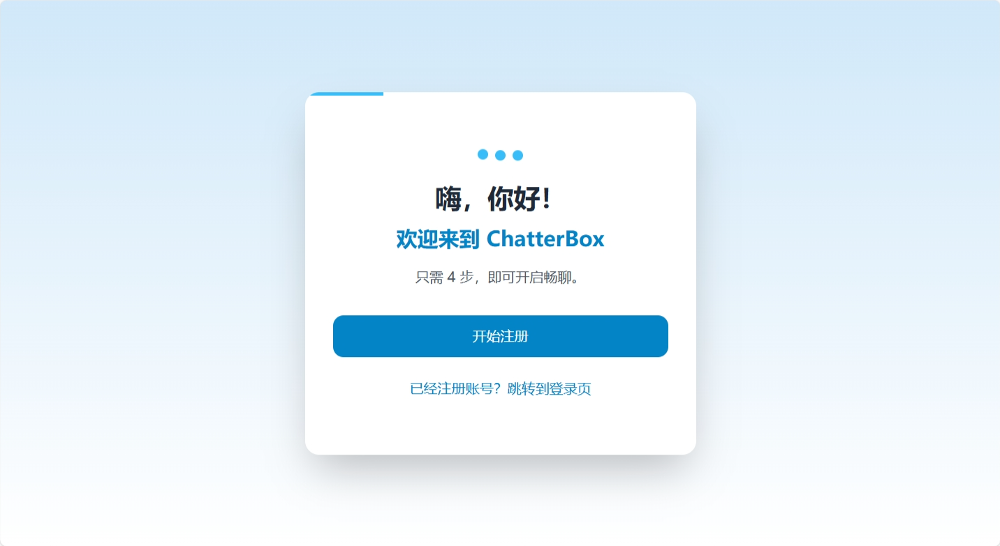
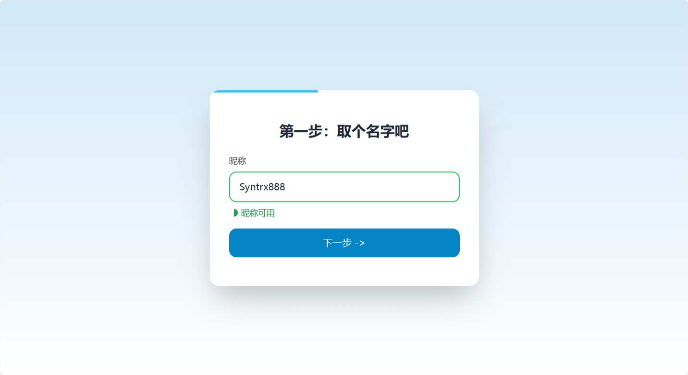
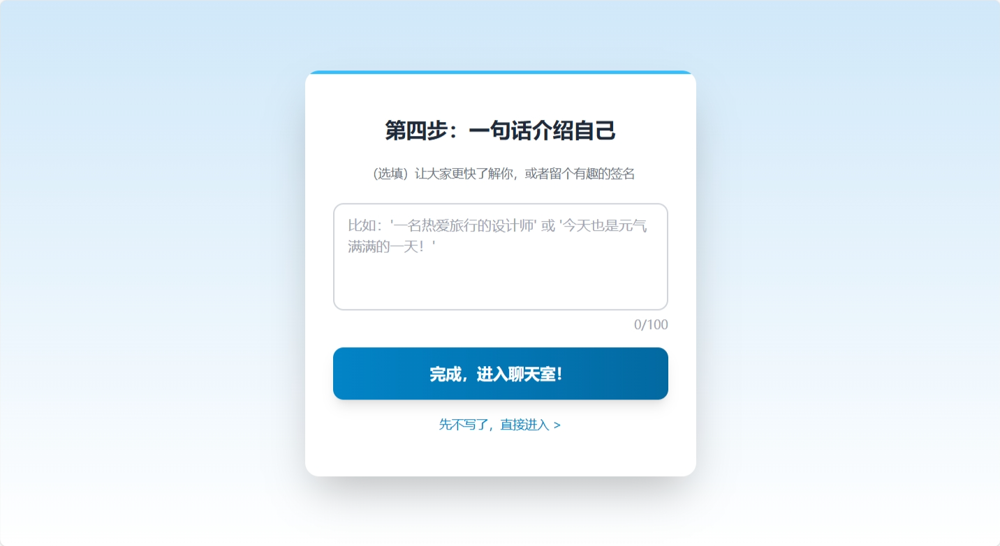
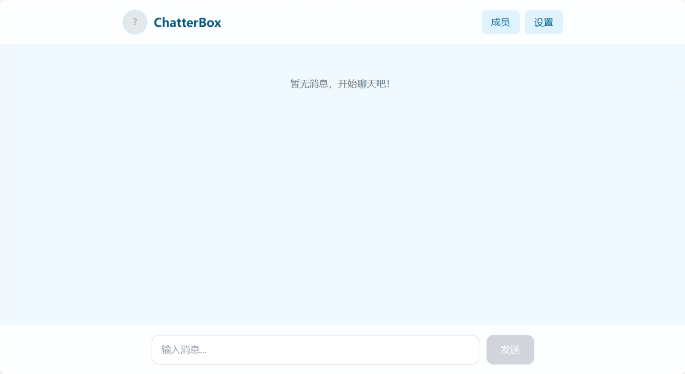
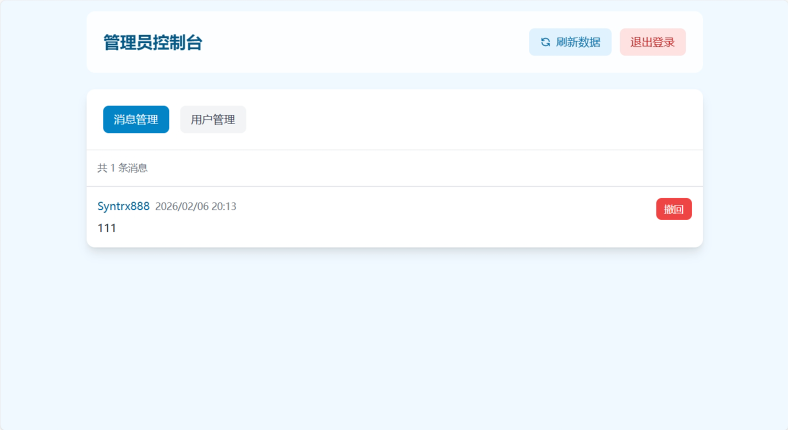

# ChatterBox

一个简洁、优雅的实时聊天室应用，采用 Vue 3 + Node.js/Express + Socket.IO 技术栈。

## 截图预览

<div align="center">
  
  
  
  
  
</div>

## 特性

- **极简设计**：采用大量留白和柔和的色彩对比
- **实时通信**：基于 Socket.IO 的实时消息推送
- **用户管理**：支持用户注册、登录、头像设置、个人简介
- **管理员系统**：
  - 管理员登录和密码设置
  - 查看所有聊天消息
  - 撤回不当消息
  - 查看用户列表
- **安全认证**：JWT Token 认证机制
- **响应式设计**：适配移动端和桌面端
- **高度可配置**：支持自定义聊天室名称、图标、头像等

## 项目结构

```
ChatterBox/
├── client/                 # 前端项目
│   ├── src/
│   │   ├── config.js      # 前端配置文件
│   │   ├── views/         # 页面组件
│   │   ├── composables/   # 组合式函数
│   │   └── main.js       # 入口文件
│   ├── package.json
│   └── vite.config.js
├── server/                # 后端项目
│   ├── config.js          # 后端配置文件
│   ├── index.js           # 服务器入口
│   ├── database.js        # 数据库配置
│   └── package.json
├── screenshots/           # 项目截图
├── README.md             # 项目文档
└── CONFIG.md             # 详细配置指南
```

> **提示**: 想了解更多配置细节和部署方案，请查看 [CONFIG.md](./CONFIG.md) 详细配置指南。

## 快速开始

### 前置要求

- Node.js >= 16
- npm 或 yarn

### 安装依赖

#### 前端

```bash
cd client
npm install
```

#### 后端

```bash
cd server
npm install
```

### 配置

#### 前端配置 (client/src/config.js)

```javascript
export default {
  API_BASE_URL: 'http://localhost:3000',  // 后端 API 地址
  chatRoomName: 'ChatterBox',              // 聊天室名称
  faviconUrl: '',                          // 网站图标 URL
  defaultAvatar: ''                        // 默认头像 URL
}
```

#### 后端配置 (server/config.js)

```javascript
module.exports = {
  port: 3000,               // 服务端口
  host: '0.0.0.0',         // 服务地址
  jwtSecret: 'your-secret-key',  // JWT 密钥（生产环境请修改）
  defaultAvatar: ''          // 默认头像 URL
}
```

### 启动服务

#### 启动后端

```bash
cd server
npm start
```

后端服务将在 `http://localhost:3000` 启动

#### 启动前端（开发模式）

```bash
cd client
npm run dev
```

前端开发服务器将在 `http://localhost:5173` 启动

#### 构建前端（生产模式）

```bash
cd client
npm run build
```

构建后的文件在 `client/dist` 目录

## API 文档

### 用户认证

#### POST /api/register
用户注册

**请求体：**
```json
{
  "username": "string",
  "password": "string",
  "avatar": "string (可选)",
  "self_description": "string (可选)"
}
```

**响应：**
```json
{
  "token": "string",
  "username": "string",
  "userId": "number",
  "avatar": "string"
}
```

#### POST /api/login
用户登录

**请求体：**
```json
{
  "username": "string",
  "password": "string"
}
```

**响应：**
```json
{
  "token": "string",
  "username": "string",
  "userId": "number",
  "avatar": "string"
}
```

#### POST /api/verify-token
验证 Token

**请求体：**
```json
{
  "token": "string"
}
```

**响应：**
```json
{
  "valid": true,
  "username": "string",
  "userId": "number"
}
```

#### GET /api/check-username?username=xxx
检查用户名是否可用

**响应：**
```json
{
  "available": true
}
```

### 管理员

#### GET /api/admin/check-setup
检查管理员是否已设置

**响应：**
```json
{
  "setup": false
}
```

#### POST /api/admin/setup
设置管理员密码（首次使用）

**请求体：**
```json
{
  "password": "string"
}
```

**响应：**
```json
{
  "success": true
}
```

#### POST /api/admin/login
管理员登录

**请求体：**
```json
{
  "password": "string"
}
```

**响应：**
```json
{
  "success": true,
  "token": "string"
}
```

#### GET /api/admin/messages
获取所有聊天消息

**响应：**
```json
[
  {
    "id": 1,
    "user_id": 1,
    "username": "string",
    "avatar": "string",
    "content": "string",
    "is_revoked": 0,
    "created_at": "string"
  }
]
```

#### POST /api/admin/revoke-message
撤回消息

**请求体：**
```json
{
  "messageId": 1
}
```

**响应：**
```json
{
  "success": true
}
```

#### GET /api/admin/users
获取所有用户列表

**响应：**
```json
[
  {
    "id": 1,
    "username": "string",
    "avatar": "string",
    "self_description": "string",
    "is_online": 1,
    "created_at": "string"
  }
]
```

### 消息

#### GET /api/members
获取成员列表

**响应：**
```json
[
  {
    "id": 1,
    "username": "string",
    "avatar": "string",
    "self_description": "string",
    "created_at": "string"
  }
]
```

### Socket.IO 事件

#### 客户端发送
- `sendMessage` - 发送消息

#### 服务器发送
- `historyMessages` - 历史消息
- `newMessage` - 新消息
- `messageDeleted` - 消息撤回通知

## 自定义配置

### 管理员设置

首次使用时，访问 `/admin` 路径进入管理员控制台：

1. 首次访问会提示设置管理员密码（至少6位）
2. 设置密码后，使用该密码登录管理员控制台
3. 管理员功能：
   - 查看所有聊天消息（包括已撤回的消息）
   - 撤回不当消息
   - 查看在线用户列表
   - 刷新数据

### 自定义聊天室名称

编辑 `client/src/config.js`：

```javascript
export default {
  chatRoomName: '我的聊天室'
}
```

### 自定义网站图标

编辑 `client/src/config.js`：

```javascript
export default {
  faviconUrl: 'https://your-domain.com/icon.png'
}
```

### 自定义默认头像

编辑 `client/src/config.js` 和 `server/config.js`：

```javascript
// 前端
export default {
  defaultAvatar: 'https://your-domain.com/default-avatar.png'
}

// 后端
module.exports = {
  defaultAvatar: 'https://your-domain.com/default-avatar.png'
}
```

### 修改服务端口和地址

编辑 `server/config.js`：

```javascript
module.exports = {
  port: 8080,
  host: '0.0.0.0'
}
```

## 许可证

MIT License

## 贡献

欢迎提交 Issue 和 Pull Request！

## 联系方式

如有问题，请提交 Issue 或联系开发者。